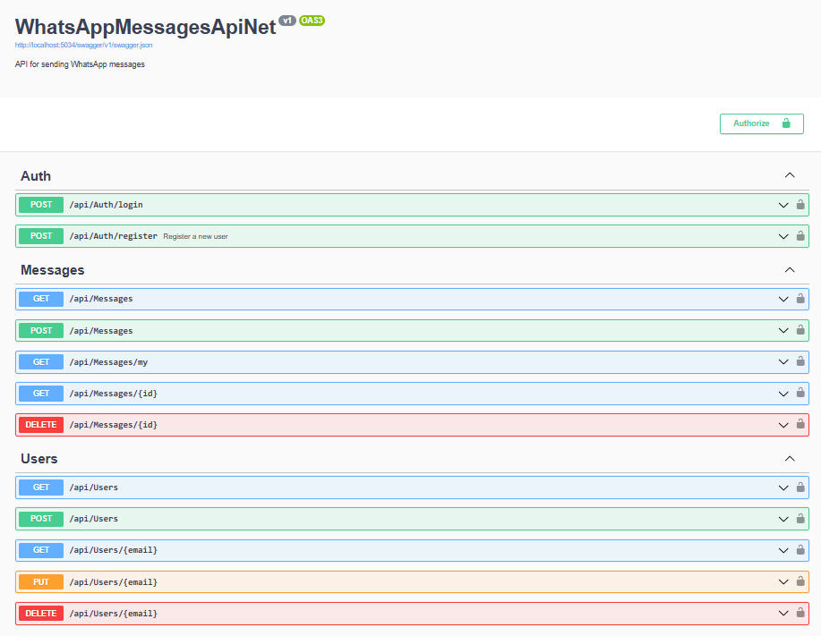
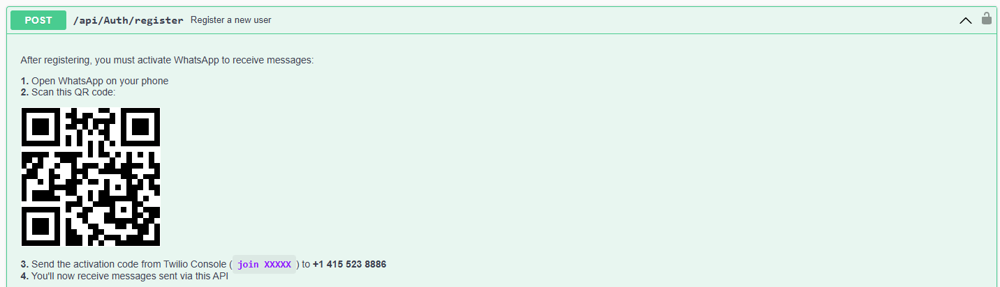
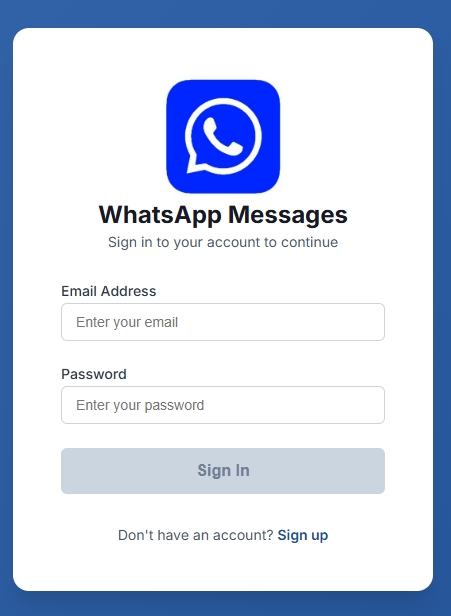
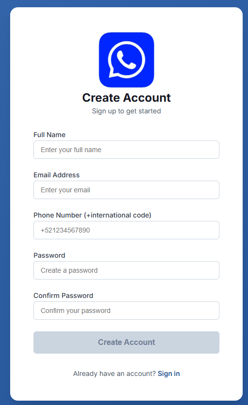
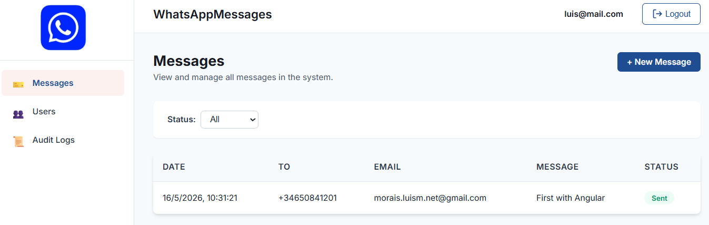
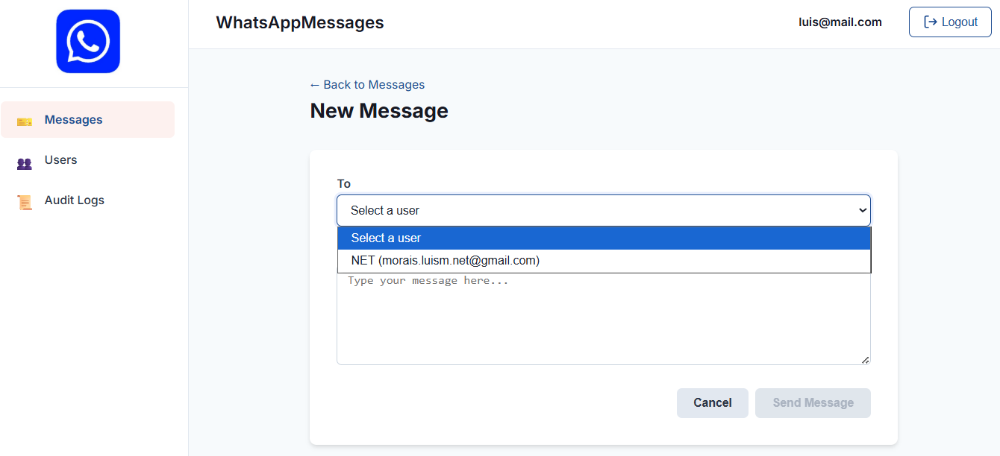
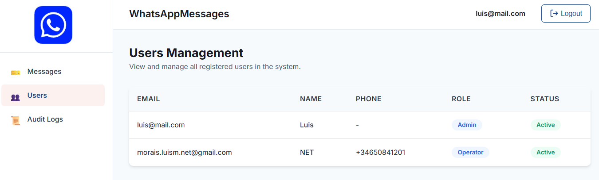
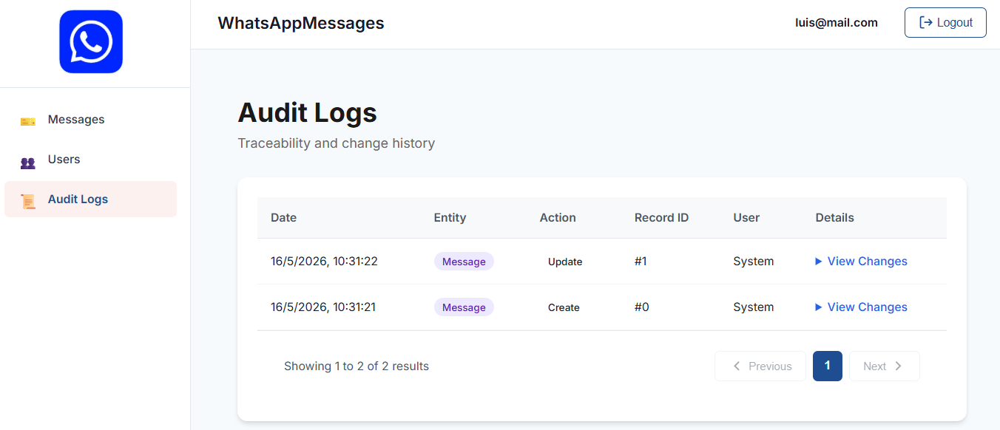
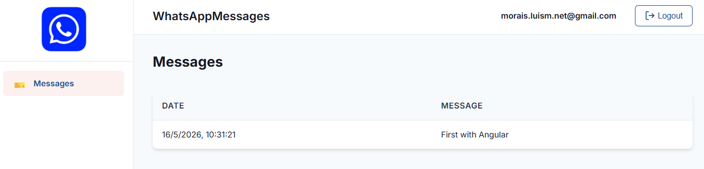

# WhatsAppMessagesApiNetAngular

A full-stack WhatsApp message management system with a **Clean Architecture .NET 8 API** backend and an **Angular 20** frontend, containerized with Docker.

---

## Key Features

### Customer Experience
- **Self-Registration**: Users can register and receive WhatsApp messages sent to their email
- **Message Inbox**: View messages addressed to the logged-in user
- **Modern UI**: Responsive Angular interface with clean, professional design

### Administration & Management
- **JWT Authentication**: Three roles — Admin, Operator, Viewer
- **Message Management**: Create, view, and delete WhatsApp messages (Admin)
- **User Management**: CRUD operations for users with role assignment (Admin)
- **Email-to-Phone Resolution**: Sending to an email auto-resolves to the recipient's phone number

### System Features
- **Multi-Database**: SQL Server (default), MySQL, PostgreSQL, SQLite, or MongoDB — switchable via config
- **Twilio Integration**: Sends WhatsApp messages via Twilio Messages API
- **Audit Trail**: Automatic change logging via EF Core interceptor
- **Swagger UI**: Interactive API documentation with JWT auth support
- **Dockerized**: Full-stack container orchestration with Docker Compose

---

## Technology Stack

| Category | Technology |
|---|---|
| **Backend** | .NET 8.0 / C# 12, Clean Architecture (4-layer) |
| **ORM** | Entity Framework Core 8.0 / MongoDB.Driver |
| **Auth** | ASP.NET Core JWT Bearer + BCrypt |
| **Mapping** | AutoMapper 13 |
| **Validation** | FluentValidation 11 |
| **Frontend** | Angular 20 (Standalone Components), TypeScript 5.8 |
| **Database** | SQL Server 2022 (Docker container) |
| **Container** | Docker, Docker Compose |
| **Web Server** | Nginx (serves Angular app) |
| **API Docs** | Swashbuckle 6 + Swagger UI |

---

## Project Structure

```
WhatsAppMessagesApiNetAngular/
├── docker-compose.yml          # Multi-container orchestration
├── start.sh                    # Build, start, and open browser
├── package.json                # Root convenience scripts
├── README.md
├── WhatsAppMessagesApiNet/     # .NET 8 Backend (Clean Architecture)
│   ├── WhatsAppMessagesApiNet.Api/
│   ├── WhatsAppMessagesApiNet.Application/
│   ├── WhatsAppMessagesApiNet.Domain/
│   ├── WhatsAppMessagesApiNet.Infrastructure/
│   ├── WhatsAppMessagesApiNet.UnitTests/
│   ├── WhatsAppMessagesApiNet.IntegrationTests/
│   └── Dockerfile
└── WhatsAppMessagesAngular/    # Angular 20 Frontend
    ├── src/
    ├── nginx.conf              # Nginx config with API proxy
    └── Dockerfile
```

---

## Getting Started

### Prerequisites

- [Docker Desktop](https://www.docker.com/products/docker-desktop/) (with Compose v2)
- Git

### Quick Start (Docker)

```bash
git clone <repository-url>
cd WhatsAppMessagesApiNetAngular
./start.sh
```

The script will:
1. Build both Docker images (API + Angular)
2. Start all containers (API, Angular, SQL Server)
3. Open `http://localhost:4200/` in your browser

Default admin credentials: `luis@mail.com` / `123456`

### Development Commands

#### Backend

```bash
cd WhatsAppMessagesApiNet/WhatsAppMessagesApiNet.Api
dotnet run
# Swagger UI at http://localhost:5034/swagger
```

#### Frontend

```bash
cd WhatsAppMessagesAngular
npm install
npm start
# Dev server at http://localhost:4200/
```

### Docker Commands

```bash
# Build and start all services
docker compose up -d

# Stop all services
docker compose down

# View logs
docker compose logs -f

# Rebuild and restart
docker compose build && docker compose up -d

# Stop and clean volumes (removes DB data)
docker compose down -v
```

---

## API Endpoints

### Auth (`/api/auth`) — Public

| Method | Route | Description |
|---|---|---|
| POST | `/api/auth/login` | Authenticate and receive JWT |
| POST | `/api/auth/register` | Create account + auto-login |

### Messages (`/api/messages`) — Authenticated

| Method | Route | Roles | Description |
|---|---|---|---|
| GET | `/api/messages` | Admin | List all messages (paginated) |
| GET | `/api/messages/my` | Any | Messages sent to the logged-in user |
| GET | `/api/messages/{id}` | Owner/Admin | Get message by ID |
| POST | `/api/messages` | Admin | Create and send a WhatsApp message |
| DELETE | `/api/messages/{id}` | Admin | Delete a message |

### Users (`/api/users`) — Admin only

| Method | Route | Description |
|---|---|---|
| GET | `/api/users` | List all users (paginated) |
| GET | `/api/users/{email}` | Get user by email |
| POST | `/api/users` | Create a new user |
| PUT | `/api/users/{email}` | Update user |
| DELETE | `/api/users/{email}` | Delete user |

---

## Configuration

### Database Provider

Set `DatabaseProvider` in `WhatsAppMessagesApiNet/WhatsAppMessagesApiNet.Api/appsettings.json`:

| Provider | Connection String Key |
|---|---|
| `SqlServer` (default) | `ConnectionStrings:SqlServer` |
| `MySql` | `ConnectionStrings:MySql` |
| `PostgreSql` | `ConnectionStrings:PostgreSql` |
| `Sqlite` | `ConnectionStrings:Sqlite` |
| `MongoDB` | `ConnectionStrings:MongoDb` + `MongoDbSettings:DatabaseName` |

### Environment Variables (Docker)

The `docker-compose.yml` configures these automatically:

| Service | Variable | Description |
|---|---|---|
| API | `ASPNETCORE_ENVIRONMENT` | Set to `Development` |
| API | `ConnectionStrings__SqlServer` | SQL Server connection string |
| SQL Server | `SA_PASSWORD` | Database SA password |
| SQL Server | `ACCEPT_EULA` | Must be `Y` to accept SQL Server EULA |

### WhatsApp Provider

Configure credentials in `appsettings.json`:

```json
"WhatsAppProviders": {
  "Default": "Twilio",
  "Twilio": {
    "AccountSid": "your_account_sid",
    "AuthToken": "your_auth_token",
    "FromPhoneNumber": "whatsapp:+14155238886"
  }
}
```

---

## Screenshots

### Backend (Swagger)

<kbd></kbd>
<kbd></kbd>

### Frontend

<kbd></kbd>
<kbd></kbd>
<kbd></kbd>
<kbd></kbd>
<kbd></kbd>
<kbd></kbd>
<kbd></kbd>

---

## Links

- [Frontend Documentation](WhatsAppMessagesAngular/README.md)
- [Backend Documentation](WhatsAppMessagesApiNet/README.md)
- [DeepWiki Project Page](https://deepwiki.com/moraisLuismNet/WhatsAppMessagesApiNetAngular)

---

Developed by [moraisLuismNet](https://github.com/moraisLuismNet)
